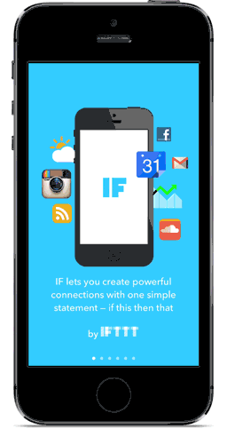

# Jazz Hands

[](https://travis-ci.org/IFTTT/JazzHands) [](https://coveralls.io/r/IFTTT/JazzHands)

Jazz Hands is a simple keyframe-based animation framework for UIKit. Animations can be controlled via gestures, scroll views, KVO, or ReactiveCocoa.

Jazz Hands is used extensively in [IF and DO by IFTTT for iPhone and iPad](https://ifttt.com/products), most famously in the app intro:



##Demo App

Open `JazzHandsDemo.xcworkspace` to see a simple demonstration of moving, scaling, fading, and transforming views in a scrolling app intro.

To run the example project, clone the repo, and run `pod install` from the `Example` directory.

##Installation

`JazzHands` is available through [CocoaPods](http://cocoapods.org). To install
it, simply add the following line to your `Podfile`:

```
pod "JazzHands"
```

You may alternatively just copy the contents of the `JazzHands` folder into your project.

##Quick Start

First, add `JazzHands` to your UIViewController.

```objc
#import <IFTTTJazzHands.h>
```

Now, create an Animator to manage all of the animations in this UIViewController.

```objc
@property (nonatomic, strong) IFTTTAnimator *animator;

// later...

self.animator = [IFTTTAnimator new];
```

Create an animation for a view that you want to animate. There are multiple
types of animation that can be applied to a view. For this example, we'll use
`IFTTTAlphaAnimation`, which fades a view in and out.

```objc
IFTTTAlphaAnimation *alphaAnimation = [IFTTTAlphaAnimation animationWithView: viewThatYouWantToAnimate];
```

Register the animation with the animator.

```objc
[self.animator addAnimation: alphaAnimation];
```

Add some keyframes to the animation. Let's fade this view out between times 30 and 60.

```objc
[alphaAnimation addKeyframeForTime:30 alpha:1.f];
[alphaAnimation addKeyframeForTime:60 alpha:0.f];
```

Now, to animate the view, tell the animator what time it is. For example, to tie this animation to a UIScrollView, notify the animator of time in the scroller's delegate method.

```objc
- (void)scrollViewDidScroll:(UIScrollView *)scrollView
{
  [super scrollViewDidScroll:scrollView];
  [self.animator animate:scrollView.contentOffset.x];
}
```

This will produce an effect where the view will be fully faded in and visible for scroll positions 0 to 30. Between scroll positions 30 and 60, the view will fade out to be invisible, and it will stay faded out for scroll positions greater than 60.

##Animation Types

Jazz Hands supports several types of animations:

+ **IFTTTAlphaAnimation** animates the `alpha` property _(creates fade effects)_.
+ **IFTTTRotationAnimation** animates a rotation transform in degrees _(for rotation effects)_.
+ **IFTTTColorAnimation** animates the `backgroundColor` property.
+ **IFTTTCornerRadiusAnimation** animates the `layer.cornerRadius` property.
+ **IFTTTHideAnimation** animates the `hidden` property _(hides and shows views)_.
+ **IFTTTScaleAnimation** applies a scaling transform _(to scale view sizes)_.
+ **IFTTTTranslationAnimation** applies a translation transform _(to translate view position)_.
+ **IFTTTTransform3DAnimation** animates the `layer.transform` property _(for 3D transforms)_.
+ **IFTTTTextColorAnimation** animates the `textColor` property of a `UILabel`.
+ **IFTTTFillColorAnimation** animates the `fillColor` property of a `CAShapeLayer`.
+ **IFTTTStrokeStartAnimation** animates the `strokeStart` property of a `CAShapeLayer`.
+ **IFTTTStrokeEndAnimation** animates the `strokeEnd` property of a `CAShapeLayer`.
+ **IFTTTConstraintConstantAnimation** animates an `AutoLayout` constraint constant.
+ **IFTTTConstraintMultiplierAnimation** animates an `AutoLayout` constraint constant as a multiple of an attribute of another view _(to offset or resize views based on another view's size)_
+ **IFTTTScrollViewPageConstraintAnimation** animates an `AutoLayout` constraint constant to place a view on a scroll view page _(to position views on a scrollView using AutoLayout)_
+ **IFTTTFrameAnimation** animates the `frame` property _(moves and sizes views. Not compatible with AutoLayout)_.

##More Examples

### Easy Paging Scrollview Layouts in an AutoLayout World
`JazzHands`'s `keepView:onPage:` method of the `IFTTTAnimatedPagingScrollViewController` is a super easy way to lay out a paging scroll view that does what you expect it to when your app is rotated or used in the new split-screen iPad views of iOS9, a notoriously tricky aspect of getting your apps fully AutoLayout-ready. `JazzHands` sets up an AutoLayout-friendly paging scroll view controller for you, and all you need to do to make your layout respond properly to any view size changes is tell `JazzHands` which page you'd like things on.

As a bonus, because it's built on top of the animations library, you can even tell `JazzHands` that you'd like one of your views to show up on multiple pages while other views scroll past, with a single call to `keepView:onPages:`.

To see the new JazzHands 2.0 AutoLayout magic in action, check out the example project.

###ReactiveCocoa

Say you want to perform some animations based on a UITableView's scroll offset, but you don't want to be the delegate for that table? ReactiveCocoa is perfect for that.

```objc
[RACObserve(self.tableView, contentOffset) subscribeNext:^(NSValue *value) {
	CGFloat y = self.tableView.contentOffset.y;
	[self.animator animate:y];
}];
```

### KVO

Or, maybe you want to animate some views based upon the position of another view? Jazz Hands works well with KVO.

```objc
- (void)viewDidLoad
{
  [self.viewToMirror addObserver:self
                      forKeyPath:@"frame"
                         options:NSKeyValueObservingOptionInitial
                         context:nil];
}

- (void)observeValueForKeyPath:(NSString *)keyPath
                      ofObject:(id)object
                        change:(NSDictionary *)change
                       context:(void *)context {

  if ([keyPath isEqualToString:@"frame"]) {
    [self.animator animate:CGRectGetMinY(self.viewToMirror.frame)];
  } else {
    [super observeValueForKeyPath:keyPath ofObject:object change:change context:context];
  }
}
```

### Gestures

Jazz Hands is flexible enough that it can accept timer input from many different types of sources, including `UIGestureRecognizer`.

```objc
- (IBAction)handlePan:(UIPanGestureRecognizer *)recognizer
{
	[self.animator animate:[recognizer locationOfTouch:0 inView:self.view].x];
}
```

## Notes

An animator can only handle one animation per type per view. If you want multiple animations of the same type on a view, use keyframes.

IFTTTFrameAnimation is not compatible with AutoLayout or any of the constraint animations.

## Contributors

* [Devin Foley](https://github.com/devinfoley), creator.
* [Laura Skelton](https://github.com/lauraskelton)

## Contributing

1. Fork it ( https://github.com/[my-github-username]/JazzHands/fork )
2. Create your feature branch (`git checkout -b my-new-feature`)
3. Commit your changes (`git commit -am 'Add some feature'`)
4. Push to the branch (`git push origin my-new-feature`)
5. Create a new Pull Request

Copyright 2015 IFTTT Inc.
